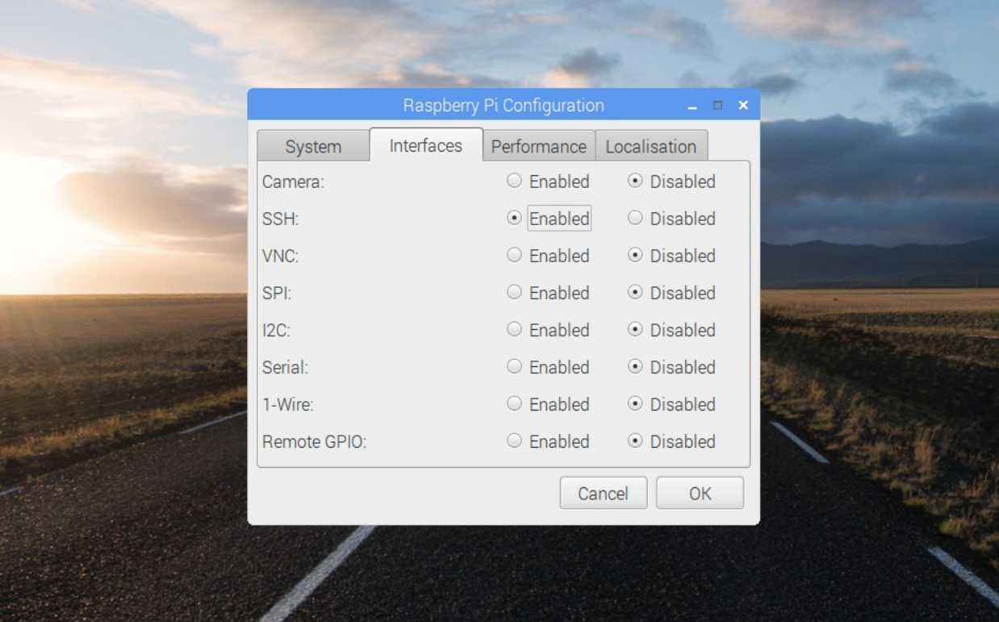
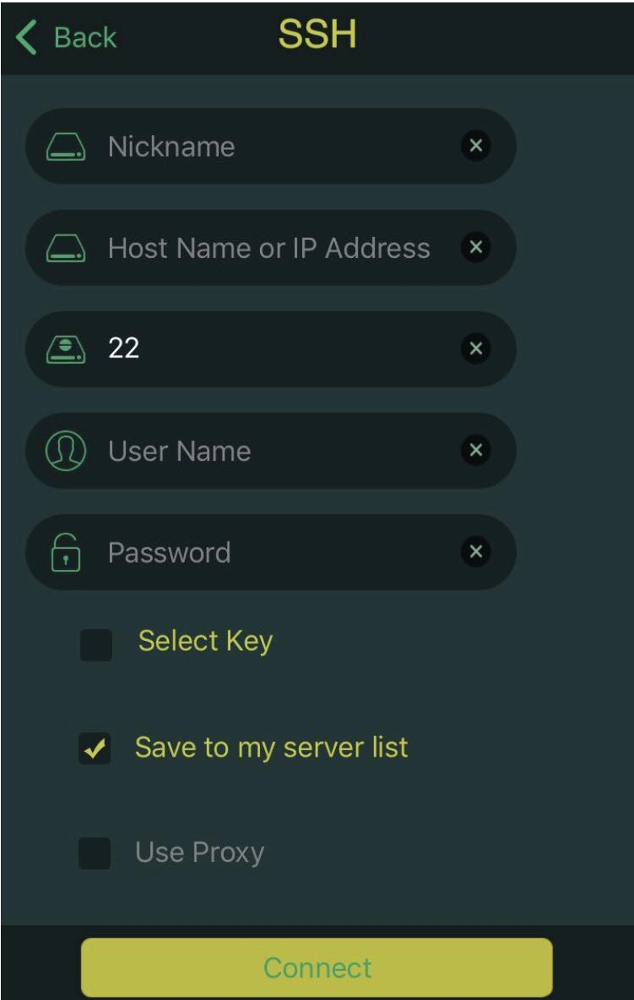

# Susi Linux

 

SUSI AI on Linux

This project aims at creating an implementation of Susi, capable to run on Linux Devices in a headless mode.
It will enable you to bring Susi AI intelligence to all devices you may think like a Speaker, Car etc.

**Current Status**
- Voice Detection working with Google Speech API/ IBM Watson Speech to Text API.
- Voice Output working with Google TTS/ IBM Watson TTS/ Flite TTS.
- Susi AI response working through Susi AI API Python Wrapper(https://github.com/fossasia/susi_api_wrapper)
- Hotword Detection works for hotword 'Susi'
- SUSI Wake Button in Raspberry Pi is working.
- Audio parsing working through SOX
- Youtube audio working MPV player
- Connection between the mobile devices and the smart speaker is done through ssh by using Access Point Mode

**Roadmap**
- Offline Voice Detection (if possible with satisfactory results)
- Configuring led lights in accordance with SUSI.AI response
- Make Update Daemon check for the updates at regular intervals
- Create an automated workflow which sets up the initialisation through the mobile app

## Setting up Susi on Linux

Setting up Susi on Linux is pretty easy.

### Minimum Requirements
* A hardware device capable to run Linux. It includes development boards like Raspberry Pi 
and other generic machines.
* A Debian based Linux Distribution. Tested on
    - Raspbian on Raspberry Pi 3
    - Ubuntu 64bit on x64 architecture
* A microphone for input. If you are using a development board like Raspberry Pi which does not have microphone
inbuilt, you can use a USB Microphone.
* A Speaker for Output. On development boards like Raspberry Pi, you can use a portable speaker that connects through
3.5mm audio jack.

### Installation on Raspberry Pi

For installation on Raspberry Pi, read [Raspberry Pi setup guide.](docs/raspberry-pi_install.md)

### Configuring a connection through SSH

Step 1: Initial Setup
* Both the raspberry Pi with raspbian installed and the mobile device should be on a same wireless network 
* One should have an SSH viewer like JuiceSSH(Android) and iTerminal(IOS) installed on their mobile devices
* Now we must enable SSH on our raspberry Pi

Step 2: Enabling SSH on Raspberry PI
* To enable SSH on your Pi , follow the following steps:
     
    `Menu > Preferences > Raspberry Pi Configuration.`
    
     
    Choose the interfaces tab and enable SSH
Step 3:Setting Up the client
* Login to your raspberry pi as the root user (pi by default)
* Type the following command to know the broadcasting ip address 
	`pi@raspberrypi:hostname -I`
* Now , open the client on your mobile device and add the configurations 

By default the username of the system is ‘pi’ and the password is ‘raspberry’

### Using SUSI in a Authenticated Mode
* To login in the speaker , first start the configuration script 
    `python3 config_generator.py`
* Follow the On Screen Instructions and agree to use SUSI in authenticated mode. 

### Installing on Ubuntu and other Debian based distributions 

For installation on Ubuntu and other Debian based distributions, read [Ubuntu Setup Guide](docs/ubuntu_install.md)

### Update Daemon

Use the folllowing commands.
* `cd update_daemon/`
* `./update_daemon.sh`

### Factory Reset

To initiate the factory reset command. 
Use the folllowing commands.
* `cd factory_reset/`
* `chmod +x factory_reset.sh`
* `./factory_reset.sh`

## Setting Up the access point mode

To allow the raspberry Pi to behave as an access point
* Execute the wap.sh script by `./wap.sh`
* To convert RasPi back to normal mode use `./rwap.sh`

## SUSI Smart Speaker - IOS/Android Workflow

