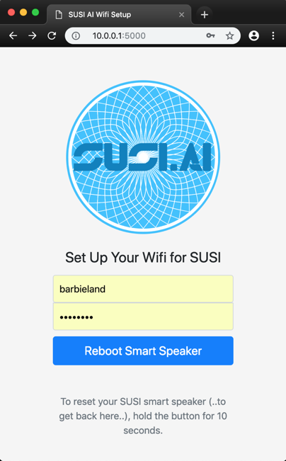

## The SUSI.AI Speaker Development DIY Kit
This is a short tutorial to get started with the parts of the SUSI.AI development kit.
You should have the following parts:

* A Raspberry Pi 3 Model B+
* A ReSpeaker 2-Mics Pi HAT
* A speaker (like Audiocore AC870) with attached JST PH 2.0 2-Pin cable
* A 3D-printed SUSI.AI Faceplate - or DIY print from https://www.thingiverse.com/thing:3124755
* A 16GB SD card with pre-flashed OS - or DIY flash from https://github.com/fossasia/susi_linux/releases/tag/0.3
* 4x 3cm spacers, 4x 2.5mm nuts, 4x 2.5mm screws, 4x 3mm screws, 4x washer, 4x 3mm nuts

An assembly video can be found at https://youtu.be/jAEmRvQLmc0

### What do you require to assemble the device
* A small crosstip/philips screwdriver
* Gripping pliers

### What else do you require to operate the device
* A Wifi hotspot and the access credentials
* A mobile phone (only android tested successfully so far)
* USB power/charger and cable

### What you should do first
* If your SD card has no image on it: download and flash
* If your SD card has an image on it: make a copy of the OS from the SD card: i.e. `sudo dd if=/dev/rdisk5 bs=16M | pv -s 16G > rpi_devstep0.img`

### Installation
The device needs an internet connection to work. To configure the device to use a wifi connection, it starts a Wifi hotspot with SSID "SUSI.AI" itself.
* Power on the device
* Connect your computer or mobile phone to the SUSI.AI hotspot using the password "password".
* Open http://10.0.0.1:5000 which will show you the set-up page as visible below:

* Put in your Wifi credentials. For an open network set an empty password. If The device should connect automatically to any open network, leave SSID and password empty.
* Click on "Reboot Smart Speaker" 
* Wait for re-boot of the speaker, SUSI will say "SUSI has started" as soon it is ready.
* If you want to return to the installation process (i.e. to configure another network), you can reset the device by pushing and holding the button for at least 10 seconds.

### Usage
* To speak to the SUSI.AI speaker, say 'susi' and wait for the 'bing' sound
* After you hear the sound, talk to susi.
* If you don't like the speaker quality you can plug external speakers into the 3.5mm jack that is on the **Respeaker Pi Hat card** 

### Problems and Fixes
The development device may crash and never work again. Here is what may happend:
* The Raspberry Pi has a huge underpower-problem. Because the processor drains a lot of current and the power must be shared with the speaker amplifier, it may happen that applications crash at any time in the development device. It may even happen during startup. You can recognize this if the red LED goes off.
* There may be unresolved bugs, configuration mistakes and whatever you might imagine. This is a development device and it is supposed to be the plattform to investigate this.

To get the device running anyway, you can do the following:
* connect a ethernet cable between the raspberry pi and your computer or connect using the wifi connection from the RPI with SSID "SUSI.AI". The password is "password".
* connect to the device with `ssh pi@raspberrypi.local`. The password is `raspberry`. If you connect using WIFI the address of the RPi is `10.0.0.1`.
* cd into the application folder: `cd SUSI.AI/susi_linux/`
* you can manually start the Susi linux client now with (i.e.) `nohup python3 -m main &`
* if you want to redefine the wifi hotspot, run `cd access_point` and `sudo ./wifi_search.sh <ssid> <pw>`. This writes the information about the wifi access point into `/etc/wpa_supplicant/wpa_supplicant.conf`
