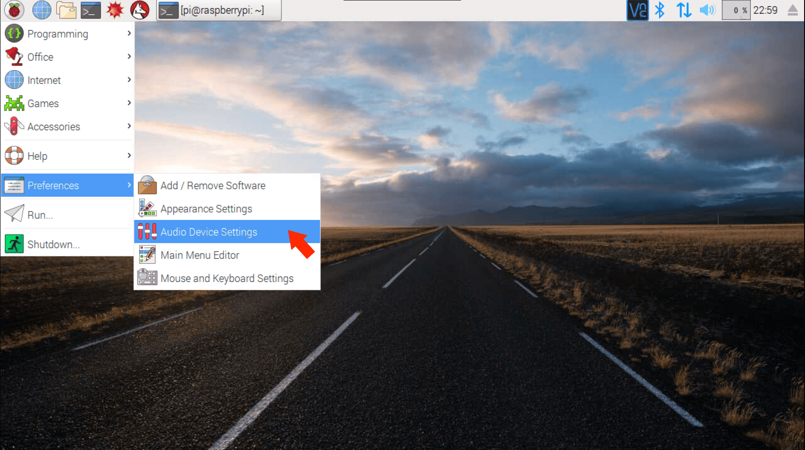
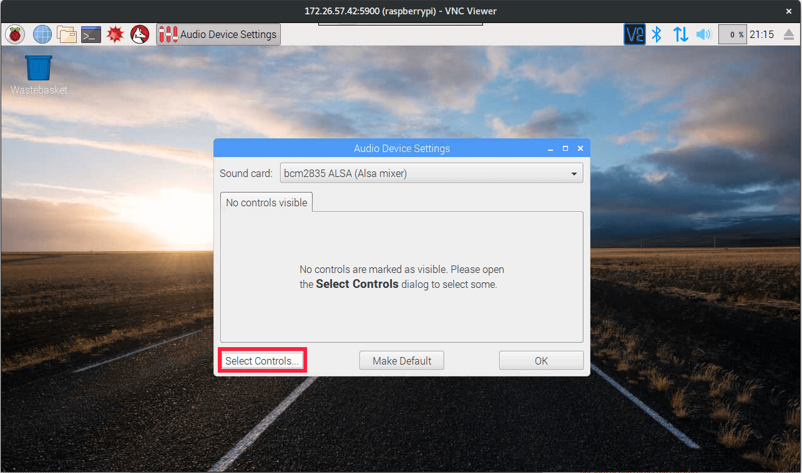
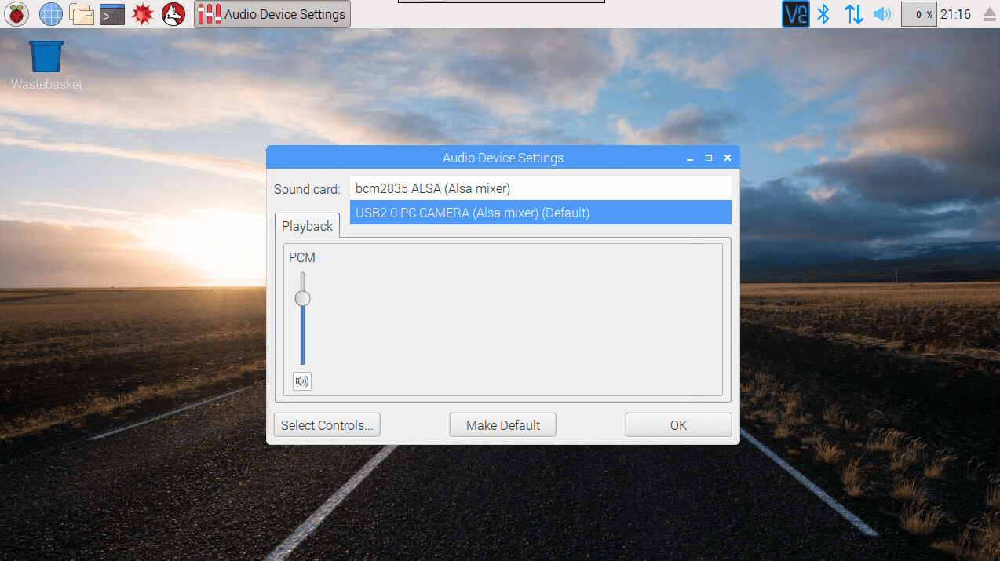
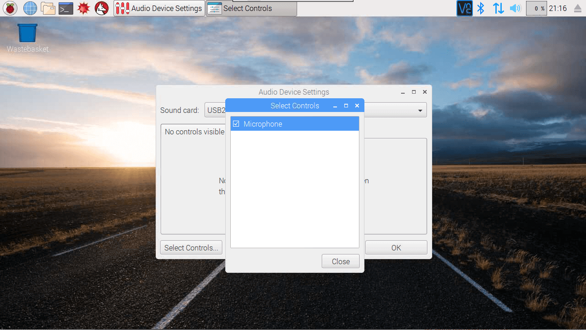
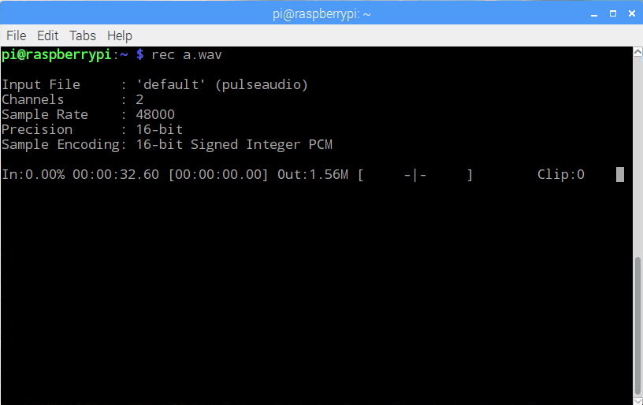
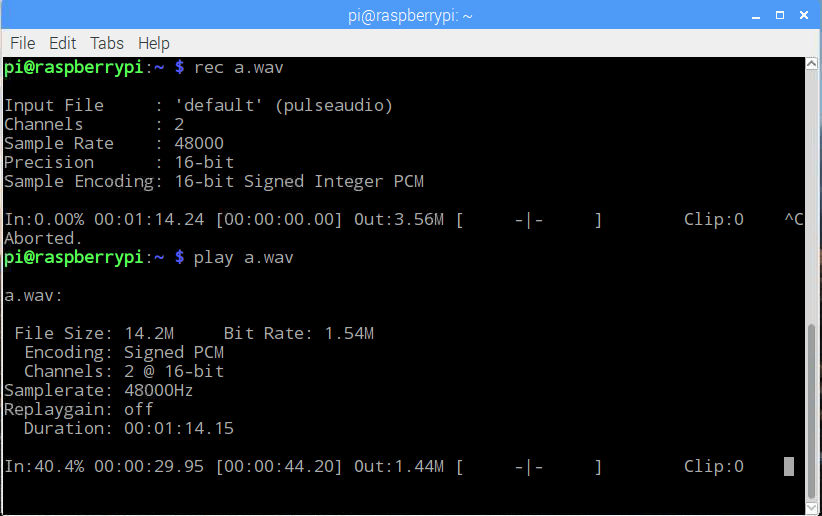
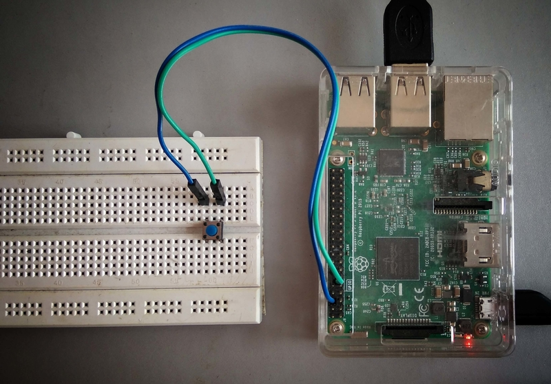
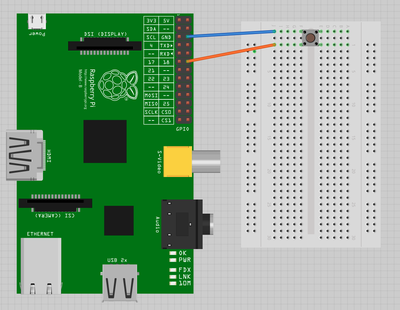

# Installation on Raspberry Pi

Tested on
- Raspberry Pi 3 with Raspbian Jessie Full 

You will need to have access to Raspberry Pi Screen and terminal for the initial setup.
You may start from ssh later.

The setup has been tested on Raspbian Jessie latest iso from Raspbian Website as on 31 July, 2017
Make sure you update your system before starting installation using
```
$ sudo apt update && sudo apt upgrade
```

### IMPORTANT

For installation of PocketSphinx on Python 3.4 (latest available on Raspbian Repositories), you need to change
system locale to ```en_US.UTF-8```. You may changes locale later after installation if you wish to.
Refer to this article for step by step instructions on changing locale to ```en_US.UTF-8```

http://rohankapoor.com/2012/04/americanizing-the-raspberry-pi/

You just need to change locale. Timezone and other changes illustrated in article are not needed.

## Steps
#### **Clone repository and install dependencies**
- Clone the repository for SUSI Linux and move into the folder
```
$ git clone https://github.com/fossasia/susi_linux.git
$ cd susi_linux
```
- Run the install script by running 
```
$ ./install.sh
```

#### Configure Microphone and Speaker
- Connect your microphone and speaker to Raspberry Pi
- Open Menu > Preferences > Audio Device Settings.

- In Audio Settings, select card bcm2835 and click on select controls button.

- Tick on PCM option and close the dialog

- Now, select card for your microphone. Since, I am using a webcam with Microphone inbuilt it
is showing it as "USB 2.0 PC Camera". It can be different for your device.

- Now click on select controls and then select the microphone control.

- You may adjust input and output volume for your devices using sliders.
- Test your microphone working by running command ```rec a.wav``` (you need the 'sox' package for this). It should give an output like below.

- Test your speaker using play command. You may play the just recorded ```a.wav``` file using
```play a.wav``` command. It should give an output like below.


If you face an error in running above 2 commands, it is quite probable the PulseAudio is not running.
Start it by running the command
```pulseaudio -D```

### Optional Hardware Wake Button


You may add an optional Push Switch to Wake Up SUSI without the need of speaking Hotword.
For enabling this, you need:
- A Push Switch
- Two Male to Female jumper Wires
- A Breadboard

#### Steps:
- Connect button to Raspberry Pi according to the following schematic diagram.


- Install Raspberry Pi GPIO Python library: ```sudo -E pip3 install RPi.GPIO```
- While running the configuration script below, select the option to enable Hardware Button when
asked.

#### Configure and Run SUSI Linux

- Run the configuration generator script. This will allow you to customize the
setup according to your needs. It can be used to modify:
    - TTS service
    - Speech Recognition service
    - Authenticate to SUSI.AI
    - Enable Hardware Wake Button.

Install required python libraries:
pip3 install --user json_config
pip3 install --user service_identity
    
Run the script using:
```
$ python3 config_generator.py
```
- Once configured, you may run SUSI by executing the following command
```
$ python3 -m main
```

This will start SUSI in always listening Hotword Detection Mode. To ask SUSI a question, say "Susi". If detection of
hotword is successful, you will hear a small bell sound. Ask your query after the bell sound. Your query will be
processed by SUSI and you will hear a voice reply.

If you have additionally enabled the Wake Button, you may press the button anytime to invoke SUSI. You will hear a small
bell after pressing button to confirm SUSI has started listening. Ask your query after that.

#### Faced any errors?

If you still face any errors in the setup, please provide a screenshot or logs of errors being encountered.
This would help rectify the issue.
