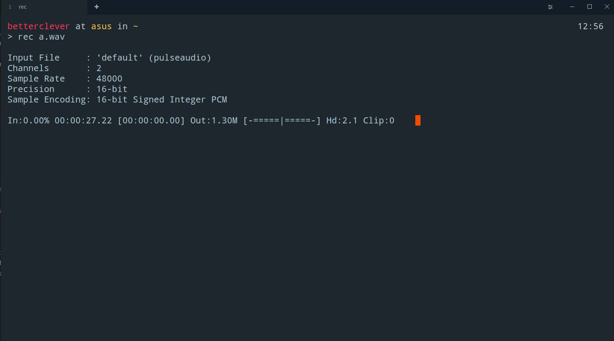
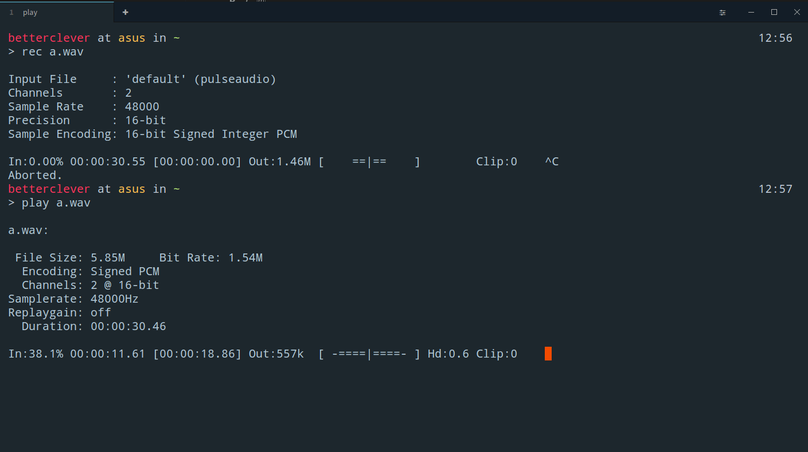

# Installation on Ubuntu and related Debian based distributions

Tested on:
- Ubuntu 16.04 (current LTS release)
- Ubuntu 17.04 (current short term release)

### Steps
- Clone the Github Repository and open folder
```
$ git clone https://github.com/fossasia/susi_linux.git
$ cd susi_linux
```
- Run the install script
````bash
$ ./install.sh
````
- Verify that your Audio setup is done properly. For this, first we need to check for recording devices. Run command 
```
$ rec a.wav
```
Verify that it gives an output like below.



- After this, play your recorded audio by running ```play a.wav```. It should give an output like below
and your audio must be audible to you.



If you hear your voice properly and output is similar to what shown in screenshots, setup is 
done correctly. If you face an error, try running ```pulseaudio -D``` and re-running the commands.
If still there is error, see if devices are selected correctly in Ubuntu sound settings.

- Run the configuration generator script and optimize the setup according to your needs.
```bash
$ python3 config_generator.py
```

- One config.json is generated, run SUSI by running command
```bash
$ python3 -m main
```

This will start SUSI in always listening Hotword Detection Mode. To ask SUSI a question, say "Susi". If detection of
hotword is successful, you will hear a small bell sound. Ask your query after the bell sound. Your query will be
processed by SUSI and you will hear a voice reply.

#### Faced any errors?

If you still face any errors in the setup, please provide a screenshot or logs of errors being encountered.
This would help rectify the issue sooner.

